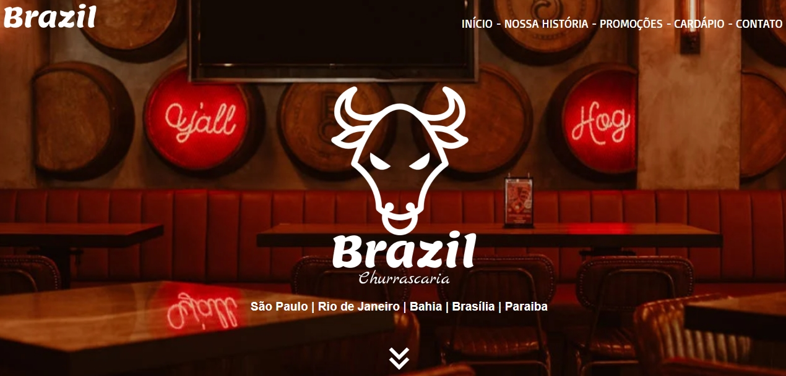

# Churrascaria Brazil 🔥
Projeto landing page responsivo de uma churrascaria, o designer foi criado por mim usando o Figma.
## 👀 Preview

Veja mais acessando o link abaixo
 
<h2>🚀 Como acessar?</h2>
- link: https://friend96.github.io/Churrascaria-Brazil/src/index.html
 
 
OU
 
- Clone o repositório
 
- Instale as dependências com yarn
 
- Inicie o servidor de dados com yarn server
 
- Em um novo terminal, inicie o servidor com yarn dev
 
- Agora você pode acessar localhost:8080 do seu navegador. :)
